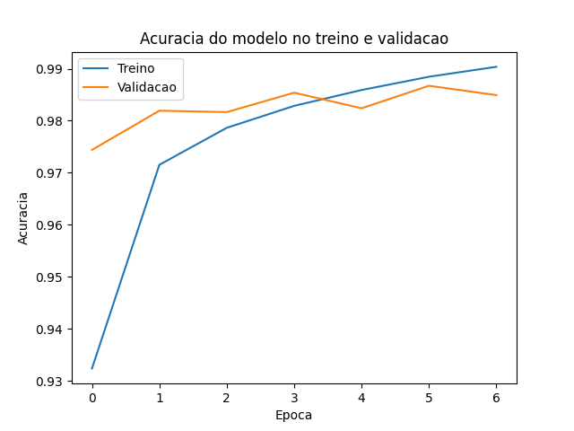
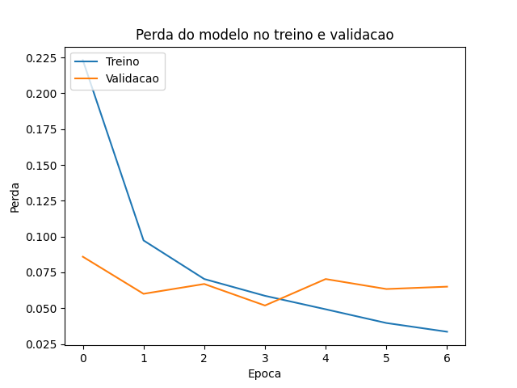

# Projeto 1 — Classificação MNIST

## 📝 Relatório do Candidato

👤 **João Emanuel Santos do Nascimento** 

### 1️⃣ Resumo da Arquitetura do Modelo

O modelo implementado em `train_model.py` é uma rede neural convolucional (CNN) para classificação dos dez dígitos do MNIST. A entrada recebe imagens em tons de cinza com formato `28 × 28 × 1`, normalizadas para o intervalo de 0 a 1.

A CNN possui três blocos convolucionais. Cada bloco contém uma camada `Conv2D` com kernel `3 × 3` (padding `valid`, ou seja, sem preenchimento — a dimensão espacial diminui a cada convolução) e, respectivamente, 32, 64 e 128 filtros, com ativação ReLU. Após cada convolução são aplicadas `BatchNormalization` e `MaxPooling2D` com janela `2 × 2`. Como não há padding, a dimensão espacial evolui assim ao longo da rede: `28×28 → 26×26 (conv) → 13×13 (pool) → 11×11 (conv) → 5×5 (pool) → 3×3 (conv) → 1×1 (pool)`.

Na etapa de classificação, a saída convolucional (`1×1×128`) é achatada por uma camada `Flatten`, processada por uma camada densa de 128 neurônios com ReLU e regularizada com `Dropout` de 50%. A camada de saída contém dez neurônios com ativação `softmax`. Calculando a partir da configuração exata das camadas, a rede possui **111.370 parâmetros no total**, dos quais **110.922 são treináveis** e **448 são não-treináveis** (estatísticas acumuladas do `BatchNormalization`).

O conjunto de treinamento original foi dividido de forma estratificada (`stratify` pela classe) em 75% para treino e 25% para validação, garantindo representação proporcional de cada dígito nos dois conjuntos. O treinamento foi configurado para até 15 épocas, usando o otimizador Adam (taxa de aprendizado 0,001), lote de 16 amostras e perda `sparse_categorical_crossentropy`. Foi utilizado `EarlyStopping` monitorando `val_loss`, com paciência de 3 épocas e restauração automática dos melhores pesos (`restore_best_weights=True`).

Após o treinamento, dois gráficos com a evolução de acurácia e perda (treino vs. validação) são salvos em arquivo:





### 2️⃣ Bibliotecas Utilizadas

- Python 3.11.9
- TensorFlow/Keras 2.12.0 / 2.12.0
- scikit-learn 1.7.2 — usada para o split estratificado treino/validação (`train_test_split`)
- NumPy 1.23.5
- Matplotlib 3.10.9 — geração dos gráficos de histórico de treino

### 3️⃣ Técnica de Otimização do Modelo

Em `optimize_model.py`, o modelo salvo em `model.h5` é convertido para TensorFlow Lite via `tf.lite.TFLiteConverter`. A linha:

```python
converter.optimizations = [tf.lite.Optimize.DEFAULT]
```

ativa a **Dynamic Range Quantization**: os pesos do modelo são quantizados para 8 bits, enquanto as ativações permanecem em ponto flutuante durante a inferência. Essa técnica foi escolhida por reduzir consideravelmente o tamanho do artefato e o consumo de memória sem exigir um dataset representativo de calibração — adequada ao escopo deste desafio, onde o objetivo é demonstrar o pipeline completo de otimização para Edge AI, não maximizar compressão a qualquer custo.

### 4️⃣ Resultados Obtidos

- **Acurácia de validação final:** 98,40%
- **Perda de validação final:** 0,0612
- **Época em que o treinamento parou (EarlyStopping):** 6
- **Tamanho de `model.h5`:** 1,34 MB
- **Tamanho de `model.tflite`:** 119 KB
- **Redução de tamanho:** 91,33%

### 5️⃣ Comentários Adicionais

A escolha de três blocos convolucionais com filtros crescentes (32 → 64 → 128) buscou equilíbrio entre capacidade de representação e tamanho do modelo — os primeiros filtros capturam padrões simples (bordas, curvas), e os últimos, combinações mais abstratas. A ausência de padding (`valid`) foi uma decisão deliberada de simplicidade, aceitando a redução progressiva da dimensão espacial em vez de preservá-la artificialmente.

O `BatchNormalization` após cada convolução ajudou a estabilizar o treinamento, e a combinação de `Dropout` (50%) com `EarlyStopping` (restaurando os melhores pesos, não os da última época) mitiga o risco de sobreajuste — importante já que o teto de 15 épocas, sem esse par de mecanismos, poderia levar o modelo a decorar o conjunto de treino em vez de generalizar.

Como limitação relevante: o MNIST contém dígitos centralizados, com fundo uniforme e baixa variabilidade de estilo — a acurácia obtida aqui não garante desempenho equivalente em condições reais mais adversas (fotos, ruído, dígitos deslocados). Além disso, o teste de inferência com 5 amostras (mínimo exigido pelo desafio) é uma verificação funcional do artefato `.tflite`, não uma avaliação estatística completa do modelo quantizado.

### 6️⃣ Exemplo de Inferência

```text
INFO: Created TensorFlow Lite XNNPACK delegate for CPU.
Rodando inferencia em 5 amostras usando model.tflite:

Amostra 1: predito=7 | real=7
Amostra 2: predito=2 | real=2
Amostra 3: predito=1 | real=1
Amostra 4: predito=0 | real=0
Amostra 5: predito=4 | real=4
```

O modelo TFLite acertou as 5 amostras testadas, incluindo dígitos com formas relativamente distintas entre si (7, 2, 1, 0, 4) — indício de que a quantização dinâmica não degradou a capacidade de classificação do modelo nessas amostras. A mensagem do XNNPACK confirma que o interpretador ativou o delegado otimizado para execução em CPU durante a inferência.
